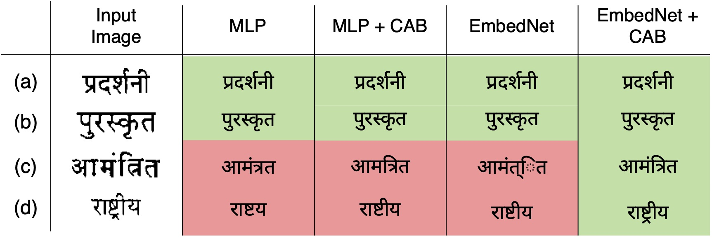

Improving Word Recognition using Multiple Hypotheses and Deep Embeddings
=================================================================================
[](http://arxiv.org/abs/2010.14411)
[](LICENSE)

### [Project page](https://sid2697.github.io/embednet_cab/) | [Paper](https://arxiv.org/pdf/2010.14411.pdf) | Poster (Coming soon!)

This repository contains code for the paper

"**Improving Word Recognition using Multiple Hypotheses and Deep Embeddings**" *[Siddhant Bansal](https://sid2697.github.io), [Praveen Krishnan](https://kris314.github.io), [C.V. Jawahar](https://faculty.iiit.ac.in/~jawahar/index.html)* 
published in [ICPR 2020](https://www.icpr2020.it).

## Abstract
We propose a novel scheme for improving the word recognition accuracy using word image embeddings. We use a trained text recognizer, which can predict multiple text hypothesis for a given word image. Our fusion scheme improves the recognition process by utilizing the word image and text embeddings obtained from a trained word image embedding network. We propose EmbedNet, which is trained using a triplet loss for learning a suitable embedding space where the embedding of the word image lies closer to the embedding of the corresponding text transcription. The updated embedding space thus helps in choosing the correct prediction with higher confidence. To further improve the accuracy, we propose a plug-and-play module called Confidence based Accuracy Booster (CAB). The CAB module takes in the confidence scores obtained from the text recognizer and Euclidean distances between the embeddings to generate an updated distance vector. The updated distance vector has lower distance values for the correct words and higher distance values for the incorrect words. We rigorously evaluate our proposed method systematically on a collection of books in the Hindi language. Our method achieves an absolute improvement of around 10% in terms of word recognition accuracy.

## Word Recognition Results
<!-- ----------- -->


Usage
-----------
### Cloning the repository
```sh
git clone https://github.com/Sid2697/Word-recognition-EmbedNet-CAB.git
cd Word-recognition-EmbedNet-CAB
```
### Install Pre-requisites
- Python >= 3.5
- PyTorch
- Scikit-learn
- NumPy
- tqdm

**`requirements.txt`** has been provided for installing Python dependencies.

```sh
pip install -r requirements.txt
```
### Generating/using deep embeddings
The deep embeddings used in this work are generated using the End2End network proposed in:
```
Krishnan, P., Dutta, K., Jawahar, C.V.: Word spotting and recognition using deep embedding. In: 2018 13th IAPR International Workshop on Document Analysis Systems (DAS). pp. 1–6 (April 2018). https://doi.org/10.1109/DAS.2018.70
```
Word text and image's deep embeddings for testing this repository are provided in the ```embeddings``` folder.
Text files containing the information about the embeddings are required while running the code. They are in the format<br>
```<img1-path><space><text1-string><space><dummyInt><space>1```<br>
```<img2-path><space><text2-string><space><dummyInt><space>1```<br>
...<br>
Corresponding text files for testing this repository are provided in the ``gen_files`` folder.

### Performing word recognition (using a pre-trained EmbedNet)
Pre-trained EmbedNet models are saved in the ``models`` folder.<br>

For running baseline word recognition use the command:
```sh
python src/word_rec_EmbedNet.py
```
For running word recognition with confidence score use the command:
```sh
python src/word_rec_EmbedNet.py --use_confidence
```
For running word recognition using a pre-trained EmbedNet use the command:
```sh
python src/word_rec_EmbedNet.py --use_confidence --use_model --hidden_layers 1024
```
For running word recognition using a pre-trained EmbedNet and the CAB module use the command:
```sh
python src/word_rec_EmbedNet.py --use_confidence --use_model --hidden_layers 1024 --cab
```
Other arguments for word recognition experiment are:
```sh
--image_embeds
--topk_embeds
--image_file
--predictions_file
--use_confidence
--cab
--cab_alpha
--cab_beta
--in_features
--out_features
--hidden_layers
--model_path
--testing
--test_split
--k
```
- `image_embeds` is used to provide path to the image embeddings
- `topk_embeds` is used to provide path to the TopK predictions' embeddings
- `image_file` is used to provide path to the image's text information file
- `predictions_file` is used to provide path to the TopK predictions' text information file
- `use_confidence` if used then confidence score is used for re-ranking the predictions
- `cab` if used then the CAB module is used for improving the word recognition accuracy
- `cab_alpha` hyper-parameter alpha defined for the CAB module
- `cab_beta` hyper-parameter beta defined for the CAB module
- `in_features` size of the input to EmbedNet
- `out_features` size of the output to EmbedNet
- `hidden_layers` list of input size of the hidden layers
- `model_path` path to the pre-trained model to be used for testing
- `testing` if used then only test set is used for evaluation
- `test_split` split for testing the trained EmbedNet on un-seen data
- `k` total number of predictions to test on (max 20)

### Training EmbedNet
TODO

License and Citation
---------------------

The software is licensed under the MIT License. If you find this work useful, please cite the following paper:

```
@misc{bansal2020fused,
      title={Fused Text Recogniser and Deep Embeddings Improve Word Recognition and Retrieval}, 
      author={Siddhant Bansal and Praveen Krishnan and C. V. Jawahar},
      year={2020},
      eprint={2007.00166},
      archivePrefix={arXiv},
      primaryClass={cs.CV}
}
```

Contact
-----------
In case of any query contact [Siddhant Bansal](https://sid2697.github.io).
